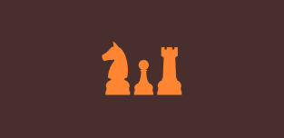

# RLChessEngine

  

  

## Description
A bitboard Chess Engine built in Rust with the goal of training a Chess Bot using Reinforcment Learning.

## Roadmap / Goals
- [ ] Bitboard  Board Representation
- [ ] Move Generation
- [ ] Check, Checkmate, Stalemate logic
- [ ] UCI Protocol Implementation (might just use a crate)
- [ ] Train AI on Engine
- [ ] Documentation
